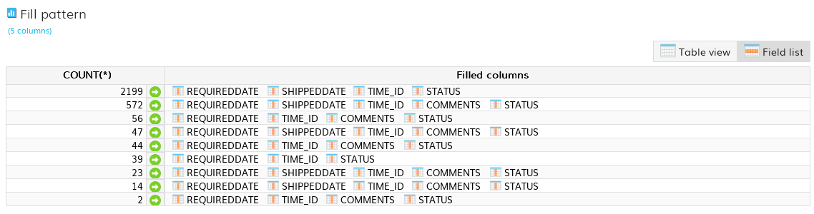
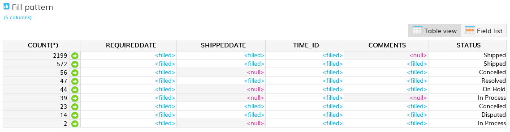

# Fill pattern analyzer

This DataCleaner plugin adds an analyzer which helps you discover the patterns of how fields/columns are filled. For example: 

 * How many addresses defined as "street + housenumber + postalcode + city", and how many are filled differently?
 * Depending on the product type, how are product attributes defined?
 * Depending on the employee type, how are the time registration entries defined?

## Input configuraiton

The analyzer takes a list of columns as input, each with an associated inspection type. Inspection types can be:

 * `Null, blank or filled` (default) - Registers values as either `<null>`, `<blank>` or `<filled>`.
 * `Null or filled` - Registers values as either `<null>` or `<filled>` (blank values counts as `<filled>` in this case).
 * `Distinct values` - Registers each distinct value. Useful for situations where only a very limited amount of values are expected (e.g. product type, country or such). But consider also the `Group column` instead.

In addition you can optionally define a `Group column` which splits the inspection into N groups.

## Output

The result of the analyzer is a list of groups of inspections. Each inspection is a list of fill patterns and associated records counts/samples. See screenshots below.

## Screenshots

 analysis example")

